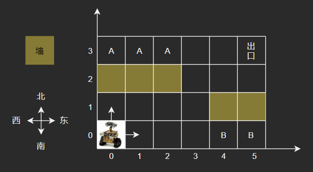
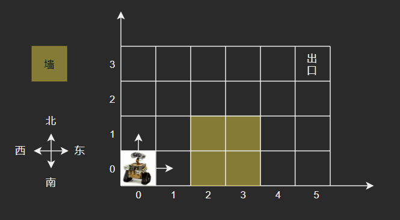

# 138 机器人走迷宫

## 题目描述

- 房间由X*Y的方格组成，例如下图为6*4的大小，每一个方格以坐标(x, y)描述。
- 机器人固定从方格(0,0)出发，只能向东或者向北前进，出口固定为房间的最东北角，如下图的方格(5,3)，用例保证机器人可以从入口走到出口。
- 房间有些方格是墙壁，如(4,1)，机器人不能经过那儿。
- 有些地方是一旦到达就无法走到出口的，如标记为`B`的方格，称为陷阱方格。
- 有些地方是机器人无法到达的，如标记为`A`的方格，称为不可达方格，不可达方格不包括墙壁所在的位置。
- 如下示例图中，陷阱方格有2个，不可达方格有3个。 请为该机器人实现路径规划功能：给定房间大小、墙壁位置，请计算出陷阱方格与不可达方格分别有多少个。



## 输入描述

第1行是房间的`X`和`Y`（0 < X, Y <= 1000）

第2行是房间中墙壁的个数`N`（0 <= N < X*Y）

接下来会有`N`行墙壁的坐标，同一行如果有多个数据，以空格隔开，用例保证所有的输入数据均合法（结尾不带回车换行）。

## 输出描述

输出陷阱方格与不可达方格数量，用一个空格隔开。

## 示例描述

### 示例一

**输入：**

```text
6 4
5
0 2
1 2
2 2
4 1
5 1
```

**输出：**

```text
2 3
```

### 示例二

**输入：**

```text
6 4
4
2 0
2 1
3 0
3 1
```

**输出：**

```text
0 4
```

**说明：**  
不可达方格有4个，分别是(4,0)、(4,1)、(5,0)、(5,1)。



## 解题思路

**基本思路：** 使用深度优先搜索DFS，从出口开始，确定每一个方格的情况。

1. 初始化所有方格的标记为`B`，都表示陷阱方格。
2. 初始化所有墙壁，标记为0。
3. 从坐标(0,0)开始深度优先搜索：
    - 确定参数：坐标值`x`、坐标值`y`、房间大小`X`和`Y`、方格数组`dp`
    - 终止条件：
        - 当方格位于最东北角，则标记为1。
        - 当方格超出边界，或位于墙壁时，则标记`A`，表示不可达方格。
        - 当方格不是陷阱方格，则返回方格值
        - 其他情况：
            - 递归遍历得到向上和向右的方格情况。
            - 如果两个位置的方格都不可达，则此方格不可达，标记为`A`。
            - 如果有一个位置的方格可以走，则此方格可以走，标记为1。
            - 返回方格值。
4. 统计陷阱方格的个数`B_cells`
5. 统计不可达方格的个数`A_cells`
6. 返回结果。

## 解题代码

```python
def dfs(x, y, X, Y, dp):
    if x == X - 1 and y == Y - 1:
        # 出口
        dp[x][y] = 1
        return 1
    elif x >= X or y >= Y or dp[x][y] == 0:
        # 墙壁
        return "A"
    elif dp[x][y] != "B":
        # 不是陷阱
        return dp[x][y]
    else:
        # 递归遍历得到向上和向右的方格情况
        up = dfs(x + 1, y, X, Y, dp)
        right = dfs(x, y + 1, X, Y, dp)
        if up == "A" and right == "A":
            # 两个位置的方格都不可达，则此方格不可达
            dp[x][y] = "A"
        elif right == 1 or up == 1:
            # 如果有一个位置的方格可以走，则此方格可以走
            dp[x][y] = 1
        return dp[x][y]


def solve_method(X, Y, obstacles):
    dp = [["B"] * Y for _ in range(X)]

    for obstacle in obstacles:
        i, j = obstacle[0], obstacle[1]
        dp[i][j] = 0

    dfs(0, 0, X, Y, dp)

    # 陷阱方格
    B_cells = sum(row.count("A") for row in dp)
    # 不可达方格
    A_cells = sum(row.count("B") for row in dp)

    return B_cells, A_cells
```