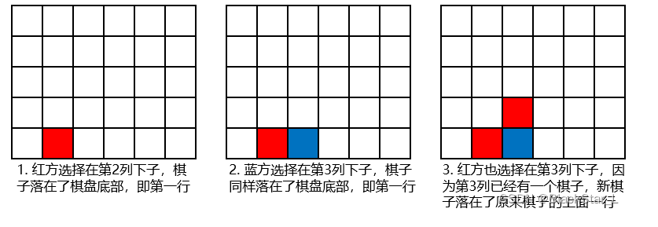
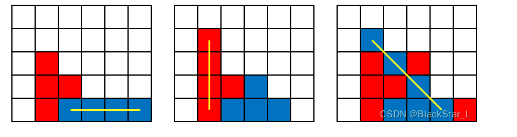

# 170 竖直四子棋

## 题目描述

竖直四子棋的棋盘是竖立起来的，双方轮流选择棋盘的一列下子，棋子因重力落到棋盘底部或者其他棋子之上，当一列的棋子放满时，无法再在这列上下子。一方的4个棋子横、竖或者斜方向连成一线时获胜。

现给定一个棋盘和红蓝对弈双方的下子步骤，判断红方或蓝方是否在某一步获胜。下面以一个6x5的棋盘图示说明落子过程：



下面给出横、竖和斜方向四子连线的图示:



## 输入描述

输入为2行，第一行指定棋盘的宽和高，为空格分隔的两个数字。

第二行依次间隔指定红蓝双方的落子步骤，第1步为红方的落子，第2步为蓝方的落子，第3步为红方的落子，以此类推。

步骤由空格分隔的一组数字表示，每个数字为落子的列的编号（最左边的列编号为1，往右递增)。用例保证数字均为32位有符号数。

## 输出描述

- 如果落子过程中红方获胜，输出`N, red`。
- 如果落子过程中蓝方获胜，输出`N, blue`。
- 如果出现非法的落子步骤，输出`N, error`。

`N`为落子步骤的序号，从1开始。如果双方都没有获胜，输出`0,draw`。

非法落子步骤有两种，一是列的编号超过棋盘范围，二是在一个已经落满子的列上落子。

`N`和单词`red`、`blue`、`draw`、`error`之间是英文逗号连接。

## 示例描述

### 示例一

**输入：**

```text
5 5
1 1 2 2 3 3 4 4
```

**输出：**

```text
7,red
```

**说明：**

在第7步，红方在第4列落下一子后，红方的四个子在第一行连成一线，故红方获胜，输出`7,red`。

### 示例二

**输入：**

```text
5 5
0 1 2 2 3 3 4 4
```

**输出：**

```text
1,error
```

**说明：**

第1步的列序号为0，超出有效列编号的范围，故输出`1, error`

## 解题思路

**基本思路：**

1. 不置换行和列，改变棋子下落方向，将棋子往y轴下坠。
2. 设置`flag`，用于判断是红方还是蓝方，-1表示蓝方，1表示红方。
3. 遍历下棋的步骤：
   - 检查落子是否有效，有效则添加棋子。
   - 检查整个棋盘是否有四个方向的4子连珠。
4. 返回结果。

## 解题代码

```python
def solve_method(row, col, chess):
    # 检查是否规范，超出界限，或重溢出
    def check_valid(c):
        # 合法范围内
        if not (1 <= c <= row):
            return False
        # 已经满了，溢出
        if 0 not in board[c - 1]:
            return False
        return True

    # 检查是否赢了
    def check_win(flag):
        color = 'red' if flag == 1 else 'blue'
        # 竖，横，左对角线，右对角线
        directions = [(0, 1), (1, 0), (1, 1), (1, -1)]

        for i in range(row):
            for j in range(col):
                if board[i][j] == color:
                    for direction in directions:
                        dr, dc = direction
                        tmp_r, tmp_c = i, j
                        count = 0
                        while 0 <= tmp_r < row and 0 <= tmp_c < col and board[tmp_r][tmp_c] == color:
                            count += 1
                            tmp_r += dr
                            tmp_c += dc
                        if count >= 4:
                            return True
        return False

    # 行列不变，将棋子往y轴下坠
    board = [[0] * col for _ in range(row)]

    # 用于判断是红方还是蓝方，-1表示蓝方，1表示红方
    flag = -1
    for ind, c in enumerate(chess):
        flag = -flag
        # 这一步落子是否有效
        if check_valid(c):
            # 有效则添加棋子
            for i in range(col):
                if board[c - 1][i] == 0:
                    board[c - 1][i] = 'red' if flag == 1 else 'blue'
                    break
            # 如果放入这个棋子赢了，返回
            if check_win(flag):
                return str(ind + 1) + ',red' if flag == 1 else str(ind + 1) + ',blue'
        else:
            return str(ind + 1) + ',error'
    return '0,draw'


if __name__ == '__main__':
    assert solve_method(5, 5, [1, 1, 2, 2, 3, 3, 4, 4]) == '7,red'  # 横
    assert solve_method(5, 5, [2, 1, 3, 1, 2, 1, 3, 1]) == '8,blue'  # 竖
    assert solve_method(5, 5, [1, 2, 2, 3, 4, 3, 3, 4, 5, 4, 4, 5]) == '11,red'  # 左对角
    assert solve_method(5, 5, [5, 4, 4, 3, 2, 3, 3, 2, 1, 2, 2, 1]) == '11,red'  # 右对角
    assert solve_method(5, 5, [1, 1, 2, 2, 1, 1, 2, 2]) == '0,draw'  # 平局
    assert solve_method(5, 5, [0, 1, 2, 2, 3, 3, 4, 4]) == '1,error'  # 超出范围
    assert solve_method(5, 5, [1, 2, 2, 2, 2, 2, 2, 4]) == '7,error'  # 放置溢出
```


