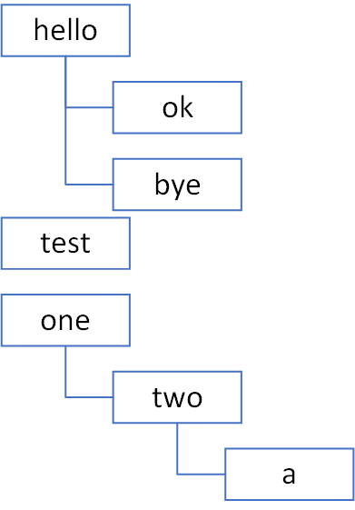

# 192 评论转换输出

## 题目描述

在一个博客网站上，每篇博客都有评论。每一条评论都是一个非空英文字母字符串。评论具有树状结构，除了根评论外，每个评论都有一个父评论。

当评论保存时，使用以下格式：
- 首先是评论的内容。
- 然后是回复当前评论的数量。
- 最后是当前评论的所有子评论。（子评论使用相同的格式嵌套存储）

所有元素之间都用单个逗号分隔。

第一条评论是`hello,2,ok,0,bye,0`，第二条评论是`test,0`，第三条评论是`one,1,two,1,a,0`。所有评论被保存成`hello,2,ok,0,bye,0,test,0,one,1,two,1,a,0`。

对于上述格式的评论，请以另外一种格式打印：
- 首先打印评论嵌套的最大深度。
- 然后是打印`n`行，第`i`行（1 <= i <= n）对应于嵌套级别为`i`的评论（根评论的嵌套级别为1）。对于第`i`行，嵌套级别为`i`的评论按照它们出现的顺序打印，用空格分隔。

## 输入描述

输入一行评论，规则如下：
- 由英文字母、数字和英文逗号组成。
- 保证每个评论都是由英文字符组成的非空字符串。
- 每个评论的数量都是整数（至少由一个数字组成）。
- 整个字符串的长度不超过106。
- 给定的评论结构保证是合法的。

## 输出描述

按照给定的格式打印评论。对于每一级嵌套，评论应该按照输入中的顺序打印。

## 示例描述

### 示例一

**输入：**

```text
hello,2,ok,0,bye,0,test,0,one,1,two,1,a,0
```

**输出：**

```text
3
hello test one
ok bye two
a
```

**说明：**

如题目描述，最大嵌套级别为3：
- 嵌套级别为1的评论是`hello test one`。
- 嵌套级别为2的评论是`ok bye two`。
- 嵌套级别为3的评论是`a`。



### 示例二

**输入：**

```text
A,5,A,0,a,0,A,0,a,0,A,0
```

**输出：**

```text
2
A
A a A a A
```

### 示例三

**输入：**

```text
A,3,B,2,C,0,D,1,E,0,F,1,G,0,H,1,I,1,J,0,K,1,L,0,M,2,N,0,O,1,P,0
```

**输出：**

```text
4
A K M
B F H L N O
C D G I P
E J
```

## 解题思路

1. 遍历所有节点：
    - 构建本层的节点列表。
    - 取出节点的字符串和子评论个数，按照评论个数，递归向下层列表中添加节点。
2. 返回按照层级的评论字符串列表。

## 解题代码

```python
def ensure_level_exists(tree, level):
    if len(tree) < level:
        # 如果本层列表不存在，则创建一个
        tree.append([])


def recursive(nodes, level, child_count, tree):
    for i in range(child_count):
        comment = nodes.pop(0)
        ensure_level_exists(tree, level)
        tree[level - 1].append(comment)
        count = int(nodes.pop(0))
        if count > 0:
            # 继续向下一层的列表中添加节点
            recursive(nodes, level + 1, count, tree)


def solve_method(line):
    nodes = line.split(",")
    tree = []
    level = 1
    while nodes:
        comment = nodes.pop(0)
        # 构建一层的节点列表
        ensure_level_exists(tree, level)
        tree[level - 1].append(comment)
        child_count = int(nodes.pop(0))
        # 继续遍历，向下一层的列表中添加节点
        recursive(nodes, level + 1, child_count, tree)

    result = []
    for nodes in tree:
        result.append(" ".join(nodes))

    return result


if __name__ == '__main__':
    line = "hello,2,ok,0,bye,0,test,0,one,1,two,1,a,0"
    assert solve_method(line) == ["hello test one", "ok bye two", "a"]

    line = "A,5,A,0,a,0,A,0,a,0,A,0"
    assert solve_method(line) == ["A", "A a A a A"]

    line = "A,3,B,2,C,0,D,1,E,0,F,1,G,0,H, 1,I,1,J,0,K,1,L,0,M,2,N,0,O,1,P,0"
    assert solve_method(line) == ["A K M", "B F H L N O", "C D G I P", "E J"]
```

