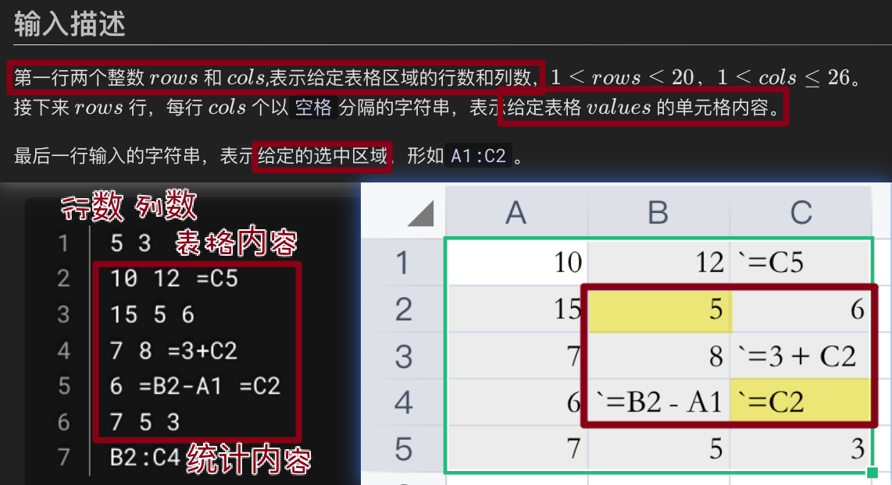

# 001 Excel单元格数值统计

## 题目描述

Excel工作表中对选定区域的数值进行统计的功能非常实用。仿照Excel的这个功能，请对给定表格中选中区域中的单元格进行求和统计，并输出统计结果。

为简化计算，假设当前输入中每个单元格内容仅为数字或公式两种：

- 如果为数字，则是一个非负整数，形如`3`、`77`。
- 如果为公式，则固定以`=`开头，且仅包含下面三种情况：
    - 等于某单元格的值，例如`=B12`。
    - 两个单元格的双目运算（仅为`+`或`-`），形如`=C1-C2`、`C3+B2`。
    - 单元格和数字的双目运算（仅为`+`或`-`），形如`=B1+1`、`100-B2`。

**注意：**

- 公式内容都是合法的，例如不存在，`=C+1`、`=C1-C2+B3`，`=5`、`=3+5`。
- 不存在循环引用，例如`A1=B1+C1`、`C1=A1+B2`。
- 内容中不存在`空格`、`括号`。

## 输入描述

第一行两个整数`rows`和`cols`，表示给定表格区域的行数和列数，取值范围是1 <= rows <= 20，1 <= cols <= 26。

接下来`rows`行，每行`cols`个以空格分隔的字符串，表示给定表格`values`的单元格内容。

最后一行输入的字符串，表示给定的选中区域，形如`A1:C2`。

## 输出描述

一个整数，表示给定选中区域各单元格中数字的累加总和，范围-2147483648 \~ 2147483647。

## 备注

表格的行号1 \~ 20，列号A \~ Z，例如单元格`B3`对应`values[2][1]`。

输入的单元格内容（含公式）中的数字均为十进制，值范围`[0,100]`。

选中区域：冒号左侧单元格表示选中区域的左上角，右侧表示右下角，如可以为`B2:C10`、`B2:B5`、`B2:Y2`、`B2:B2`，无类似`C2:B2`、`C2:A1`的输入。

## 示例描述

### 示例一

**输入**

```text
5 3
10 12 =C5
15 5 6
7 8 =3+C2
6 =B2-A1 =C2
7 5 3
B2:C4
```

**输出**

```text
29
```

### 示例二

**输入**

```text
1 3
1 =A1+C1 3
A1:C1
```

**输出**

```text
8
```

## 解题思路

**一些知识点：**

- 二维表格表示、访问。
- 字符串匹配、正则匹配。

**简单提示：**

1. 用正则匹配并提取公式内容。
2. 递归求解表中所有数据的真实值。
3. 按照范围遍历求和。

**分析题目输入输出要求：**

- 对输入的可视化分析如下图：
  
- 关键需求为**单元格数值统计**。
- 单元格的内容为数字或公式。
- 数字为**非负整数**。
- 公式为单元格之间或单元格与数字之间的**简单双目运算** (`+`或`-`)。
- 无需考虑非法输入。

**一种可行的算法步骤：**

1. 读取输入，解析出表格内容，存入二维列表`table`。
2. 解析最后的选中区域，获得左上角和右下角单元格坐标。
3. 定义变量`sum`初始化为0。
4. 遍历选中区域每一个单元格，判断内容：
    - 如果是数字，直接加入`sum`。
    - 如果是公式，计算公式结果，再加入`sum`。
5. 打印`sum`输出结果。

## 解题代码

```python
import re

add_sub_pattern = re.compile(r'[\\+\-]')
# ([A-Z])? 匹配一个可选的大写字母，用来表示列号
# ([0-9]+) 匹配一个或多个数字，用来表示行号
# (:) 匹配一个冒号，用来分隔起始和结束的单元格
# ([A-Z])?([0-9]+) 重复前面的模式，用来匹配结束的单元格
area_pattern = re.compile(r'([A-Z])?([0-9]+)(:)([A-Z])?([0-9]+)')


def get_cell_value(cell, sheet):
    # 如果第一个符号不是A~Z，则为直接数，'A' > '9'
    if cell[0] >= 'A':
        return int(sheet[int(cell[1]) - 1][ord(cell[0]) - ord('A')])
    else:
        return int(cell)


def evaluate(value, sheet):
    # 通过正则表达式找到 + / -
    add_sub_sig = add_sub_pattern.search(value)
    c1 = value
    c2 = 0
    # 如果有 + / - ，说明不是单独的 =cell
    if add_sub_sig:
        add_sub_sig = add_sub_sig.group()
        idx = value.index(add_sub_sig)
        c1 = value[:idx]
        c2 = value[idx + 1:]
        # 获取单元格的值 或 将字符串转化为数字
        c2 = get_cell_value(c2, sheet)

    # 获取单元格的值 或 将 字符串转化为数字
    c1 = get_cell_value(c1, sheet)

    # 计算表达式的值返回出去
    if add_sub_sig:
        if add_sub_sig == '+':
            return c1 + c2
        else:
            return c1 - c2
    else:
        return c1


def solve_method(rows, cols, sheet, area):
    # 将表格中的"=xxx"表达式 计算为数值
    for r in range(rows):
        for c in range(int(cols)):
            if sheet[r][c].startswith('='):
                sheet[r][c] = evaluate(sheet[r][c][1:], sheet)

    # 正则匹配处理统计区域
    area = area_pattern.search(area)
    # 处理正则匹配拆出来的内容
    c_start, r_start, _, c_end, r_end = area.groups()
    r_start, r_end = int(r_start) - 1, int(r_end) - 1
    c_start, c_end = ord(c_start) - ord('A'), ord(c_end) - ord('A')

    # 计算需要统计区域的值的和
    return sum(int(sheet[r][c]) for r in range(r_start, r_end + 1) for c in range(c_start, c_end + 1))


if __name__ == '__main__':
    sheet = [["10", "12", "=C5"],
             ["15", "5", "6"],
             ["7", "8", "=3+C2"],
             ["6", "=B2-A1", "=C2"],
             ["7", "5", "3"]]
    assert solve_method(5, 3, sheet, "B2:C4") == 29

    sheet = [["1", "=A1+C1", "3"]]
    assert solve_method(1, 3, sheet, "A1:C1") == 8
```