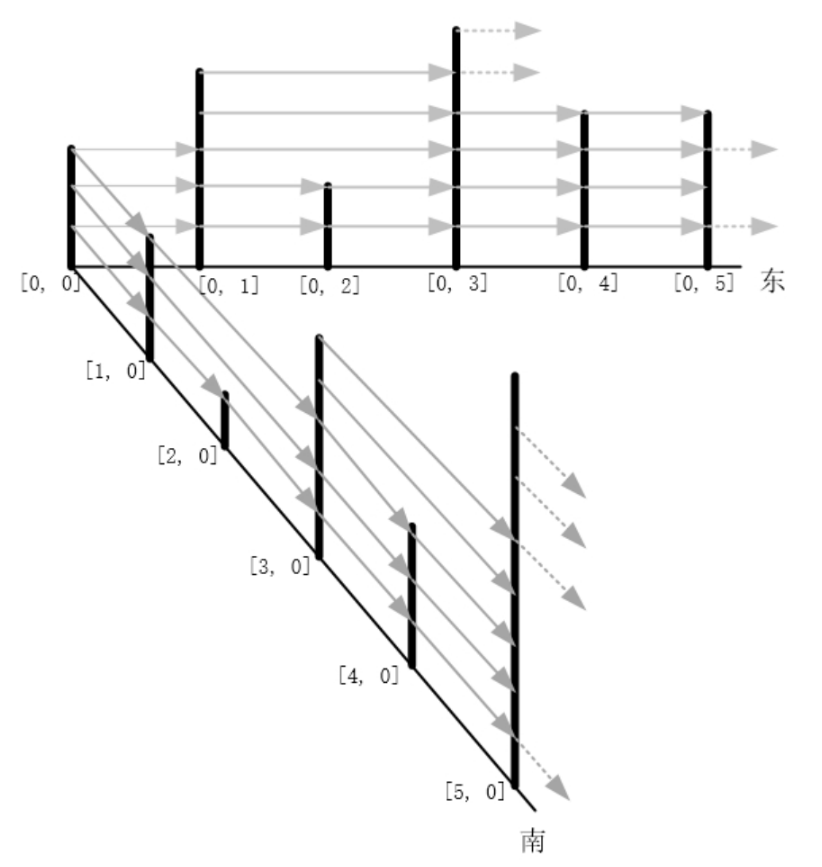

## 227 信号发射和接收

## 题目描述

有一个二维的天线矩阵，每根天线可以向其他天线发射信号，也能接收其他天线的信号，为了简化起见，我们约定每根天线只能向东和向南发射信号，换言之，每根天线只能接收东向或南向的信号。

每根天线有自己的高度anth，每根天线的高度存储在一个二维数组中，各个天线的位置用`[r, c]`表示，r代表天线的行位置（从0开始编号），c代表天线的列位置（从0开始编号）。

在某一方向（东向或南向），某根天线可以收到多根其他天线的信号（也可能收不到任何其他天线的信号），对任一天线X和天线Y，天线X能接收到天线Y的条件是：

天线X在天线Y的东边或南边  
天线X和天线Y之间的其他天线的高度都低于天线X和天线Y，或天线X和天线Y之间无其他天线，即无遮挡。  
如下图示意：  



在天线矩阵的第0行上：

- 天线`[0, 0]`接收不到任何其他天线的信号，
- 天线`[0, 1]`可以接收到天线`[0, 0]`的信号，
- 天线`[0, 2]`可以接收到天线`[0, 1]`的信号，
- 天线`[0, 3]`可以接收到天线`[0, 1]`和天线`[0, 2]`的信号，
- 天线`[0, 4]`可以接收到天线`[0, 3]`的信号，
- 天线`[0, 5]`可以接收到天线`[0, 4]`的信号；

在天线的第0列上：

- 天线`[0, 0]`接收不到任何其他天线的信号，
- 天线`[1, 0]`可以接收到天线`[0, 0]`的信号，
- 天线`[2, 0]`可以接收到天线`[1, 0]`的信号，
- 天线`[3, 0]`可以接收到天线`[1, 0]`和天线`[2, 0]`的信号，
- 天线`[4, 0]`可以接收到天线`[3, 0]`的信号，
- 天线`[5, 0]`可以接收到天线`[3, 0]`和天线`[4, 0]`的信号；  

    给一个m行n列的矩阵（二维数组），矩阵存储各根天线的高度，求出每根天线可以接收到多少根其他天线的信号，结果输出到m行n列的矩阵（二维矩阵）中。

## 输入描述

输入为1个m行n列的矩阵（二维矩阵）`anth[m][n]`，矩阵存储各根天线的高度，高度值`anth[r]][c]`为大于0的整数。

第一行为输入矩阵的行数和列数，如：`m n`第二行为输入矩阵的元素值，按行输入，如：
`anth[0][0] anth[0][1] ... anth[0][n-1] anth[1][0] anth[1][1] ... anth[1][n-1] ... anth[m-1][0] ... anth[m-1][n-1]`

## 输出描述

输出一个m行n列的矩阵（二维数组）`ret[m][n]`，矩阵存储每根天线能收到多少根其他天线的信号，根数为`ret[r][c]`。

第一行为输出矩阵的行数和列数，如:`m n`第二行为输出矩阵的元素值，按行输出，如：`ret[0][0] ret[0][1] ... ret[0][n-1] ret[1][0] ret[1][1] ... ret[1][n-1] ... ret[m-1][0] ... ret[m-1][n-1]`

## 备注

$1≤m≤5001 \leq m \leq 5001≤m≤500$
$1≤n≤5001 \leq n \leq 5001≤n≤500$
$0<anth[r][c]<1050 < anth[r][c] < 10^50<anth[r][c]<105$

## 示例描述
### 示例一

**输入：**
```
1 6
2 4 1 5 3 3
```

**输出：**
```
1 6
0 1 1 2 1 1
```

**说明：**  
输入为1行6列的天线矩阵的高度值`[2 4 1 5 3 3]`
输出为1行6列的结果矩阵`[0 1 1 2 1 1]`

### 示例二

**输入：**
```
2 6
2 5 4 3 2 8 9 7 5 10 10 3
```

**输出：**
```
2 6
0 1 1 1 1 4 1 2 2 4 2 2
```

**说明：**  
输入为2行6列的天线矩阵高度值`[2 5 4 3 2 8][9 7 5 10 10 3]`

输出为2行6列的结果矩阵`[0 1 1 1 1 4][1 2 2 4 2 2]`

## 解题思路
**简单提示**
这道题目要求从一个二维矩阵（代表天线的高度）中计算出每个天线能接收到多少个其他天线的信号。每个天线只能向东（即向右）或向南（即向下）接收信号，而且必须满足天线X和天线Y之间的所有天线的高度都低于天线X和天线Y。所以，我们需要对每个天线进行检查，看它能否接收到其他天线的信号。

## 解题代码
``` python
def can_receive(ant_heights):
    # 如果相邻，一定能接收到信号
    if len(ant_heights) == 2:
        return True
    
    start_ant = ant_heights[0]
    end_ant = ant_heights[len(ant_heights) -1]
    next_ant_idx = 1
    temp_height = 0
    
    # 判断中间是否有阻碍
    while next_ant_idx < len(ant_heights) - 1:
        next_ant = ant_heights[next_ant_idx]
        # 如果起始天线矮于下一个天线，则无法接收到
        if start_ant <= next_ant:
            return False
        
        temp_height = max(temp_height, next_ant)
        # 如果中间最高的天线高于 终点天线，则无法接收到
        if temp_height >= end_ant:
            return False
        
        next_ant_idx += 1
    
    return True

def solve_method(
        rows: int,
        cols: int,
        ant_heights: list[list[int]],
):
    ret = [[0] * cols for _ in range(rows)]

    # 从右下角开始反向遍历
    for i in range(rows):
        for j in range(cols):
            if i != rows-1:
                k = i + 1
                ant_cols = [row[j] for row in ant_heights]
                # 遍历南向的后续天线 判断是否能接收到当前天线的信号
                while k < rows:
                    if can_receive(ant_cols[i : k + 1]):
                        ret[k][j] += 1
                    k += 1
            if j != cols -1:
                k = j + 1
                # 遍历东向的后续天线 判断是否能接收到当前天线的信号
                while k < cols:
                    if can_receive(ant_heights[i][j : k + 1]):
                        ret[i][k] += 1
                    k += 1

    # 输出结果矩阵
    return rows, cols, ret

if __name__ == '__main__':
    heights = [[2, 4, 1, 5, 3, 3]]
    output = [[0, 1, 1, 2, 1, 1]]
    assert solve_method(1, 6, heights) == (1, 6, output)

    heights = [[2, 5, 4, 3, 2, 8], [9, 7, 5, 10, 10, 3]]
    output = [[0, 1, 1, 1, 1, 4], [1, 2, 2, 4, 2, 2]]
    assert solve_method(2, 6, heights) == (2, 6, output)
```