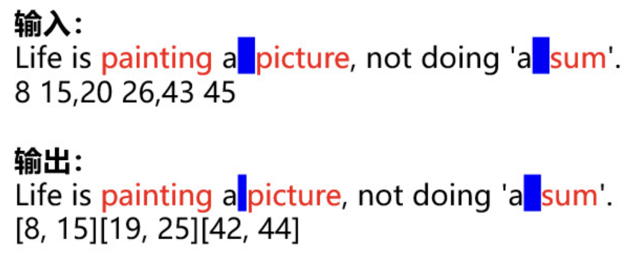

# 232 去除多余空格

## 题目描述

去除文本多余空格，但不去除配对单引号之间的多余空格。给出关键词的起始和结束下标，去除多余空格后，刷新关键词的起始和结束下标。

例如：


条件约束：
1. 不考虑关键词起始和结束位置为空格的场景。
2. 单词的开始和结束下标保证涵盖一个完整的单词，即一个坐标对开始和结束下标之间不会有多余的空格。
3. 如果有单引号，则用例保证单引号成对出现。
4. 关键词可能会重复。
5. 文本字符长度`length`的取值范围为`[0, 100000]`。

## 输入描述

输入为两行字符串：

第一行：待去除多余空格的文本，用例保证如果有单引号，则单引号成对出现，且单引号可能有多对。

第二行：关键词的开始和结束坐标，关键词间以逗号区分，关键词内的开始和结束位置以单空格区分。

例如：
```
Life is painting a  picture, not doing 'a  sum'.
8 15,20 26,43 45
```

关键单词为：`painting`、`picture`、`sum`。

## 输出描述

输出为两行字符串：

第一行：去除多余空格后的文本。

第二行：去除多余空格后的关键词的坐标开始和结束位置，为数组方式输出。

例如：
```
Life is painting a picture, not doing 'a  sum'.
[8, 15][19, 25][42, 44]
```

## 示例描述

### 示例一

**输入：**
```text
Life is painting a  picture, not doing 'a  sum'.
8 15,20 26,43 45
```

**输出：**
```text
Life is painting a picture, not doing 'a  sum'.
[8, 15][19, 25][42, 44]
```

**说明：** 

`a`和`picture`中间多余的空格进行删除。

### 示例二

**输入：**
```text
Life is painting a picture, not doing 'a  sum'.
8 15,19 25,42 44
```

**输出：**
```text
Life is painting a picture, not doing 'a  sum'.
[8, 15][19, 25][42, 44]
```

**说明：** 

`a`和`sum`之间有多余的空格，但是因为有成对单引号，不去除多余空格。

## 解题思路

1. 初始化单引号标识`in_barcket`、空格标识`has_space`。
2. 遍历所有字符，删除多余空格，记录空格的位置，存入待删除的空格位置列表`spaces_index`。
3. 遍历空格位置列表，移动关键词坐标。
4. 返回处理后的文本和关键词坐标。

## 解题代码

```python
def solve_method(text, key_words_idx):
    text_res = ""
    spaces_index = []
    idx = 0
    in_bracket = False
    has_space = False

    # 删除多余空格
    while idx < len(text):
        c = text[idx]
        if c == "'":
            in_bracket = not in_bracket
            text_res += c
            idx += 1
            continue

        if in_bracket:
            text_res += c
        else:
            # 不在单引号中
            if has_space and c == " ":
                # 如果有空格，并且当前这个也是空格，则需要删除
                spaces_index.append(idx)
                idx += 1
                continue

            if c == " ":
                has_space = True
            else:
                has_space = False

            text_res += c
        idx += 1

    # 根据删除空格的index，计算新的关键词坐标
    for space_idx in spaces_index[::-1]:
        for idx in key_words_idx:
            if idx > space_idx:
                key_words_idx[key_words_idx.index(idx)] -= 1

    # 返回处理后的文本和关键词坐标
    keyWordsIdxRes = [key_words_idx[i:i + 2] for i in range(0, len(key_words_idx), 2)]
    return text_res, keyWordsIdxRes


if __name__ == '__main__':
    text = "Life is painting a  picture, not doing 'a  sum'."
    key_words_idx = [8, 15, 20, 26, 43, 45]

    text_res = "Life is painting a picture, not doing 'a  sum'."
    key_words_idx_res = [[8, 15], [19, 25], [42, 44]]

    assert solve_method(text, key_words_idx) == (text_res, key_words_idx_res)

    text = "Life is painting a picture, not doing 'a  sum'."
    key_words_idx = [8, 15, 19, 25, 42, 44]

    text_res = "Life is painting a picture, not doing 'a  sum'."
    key_words_idx_res = [[8, 15], [19, 25], [42, 44]]

    assert solve_method(text, key_words_idx) == (text_res, key_words_idx_res)

    text = "Life is painting a   picture, not doing 'a  sum'."
    key_words_idx = [8, 15, 21, 27, 44, 46]

    text_res = "Life is painting a picture, not doing 'a  sum'."
    key_words_idx_res = [[8, 15], [19, 25], [42, 44]]

    assert solve_method(text, key_words_idx) == (text_res, key_words_idx_res)
```