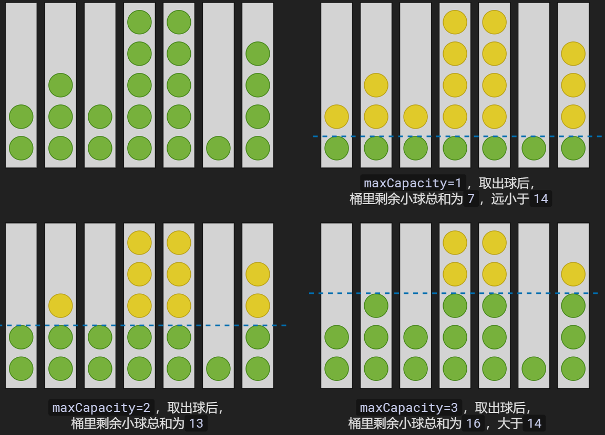

# 238 开放日活动

## 题目描述

某部门开展Family Day开放日活动，其中有个从桶里取球的游戏，游戏规则如下：

有`N`个容量一样的小桶等距排开，且每个小桶都默认装了数量不等的小球，每个小桶装的小球数量记录在数组`bucketBallNums`中。

游戏开始时，要求所有桶的小球总数不能超过`SUM`，如果小球总数超过`SUM`，则需对所有的小桶统一设置一个容量最大值`maxCapacity`，并需将超过容量最大值的小球拿出来，直至小桶里的小球数量小于`maxCapacity`。

请您根据输入的数据，计算从每个小桶里拿出的小球数量。

限制规则：
1. 所有小桶的小球总和小于`SUM`，则无需设置容量值，并且无需从小桶中拿球出来，返回结果`[]`。
2. 如果所有小桶的小球总和大于`SUM`，则需设置容量最大值`maxCapacity`，并且需从小桶中拿球出来，返回从每个小桶拿出的小球数量组成的数组。

## 输入描述

第一行输入2个正整数，数字之间使用空格隔开，其中第一个数字表示`SUM`，第二个数字表示`bucketBallNums`数组长度。

第二行输入`N`个正整数，数字之间使用空格隔开，表示`bucketBallNums`的每一项。

## 输出描述

输出从每个小桶里拿出的小球数量组成的数组。

## 备注

- 1 <= bucketBallNums[i] <= 10^9
- 1 <= bucketBallNums.length = N <= 10^5
- 1 <= maxCapacity <= 10^9
- 1 <= SUM <= 10^9

## 示例描述

### 示例一

**输入：**
```text
14 7
2 3 2 5 5 1 4
```

**输出：**
```text
[0,1,0,3,3,0,2]
```

**说明：** 

小球总数为22，`SUM=14`，超出范围了，需从小桶取球。

- 假设`maxCapacity=1`，取出球后，桶里剩余小球总和为7，远小于14。
- 假设`maxCapacity=2`，取出球后，桶里剩余小球总和为13，小于14。
- 假设`maxCapacity=3`，取出球后，桶里剩余小球总和为16，大于14。

因此 `maxCapacity`为2，每个小桶小球数量大于2的都需要拿出来。



### 示例二

**输入：**
```text
3 3
1 2 3
```

**输出：**
```text
[0,1,2]
```

**说明：** 

小球总数为6，`SUM=3`，超出范围了，需从小桶取球：

- 假设`maxCapacity=1`，则小球总数为3，等于3。

所以从0号桶取出0个球，从1号桶取出1个球，从2号桶取出2个球。

### 示例三

**输入：**
```
6 2
3 2
```

**输出：**
```
[]
```

**说明：** 

小球总数为5，`SUM=6`，在范围内，无需从小桶取球；

## 解题思路

1. 计算所有小桶的小球总和`total`，如果总和小于`SUM`，则无需从小桶中拿球出来，返回`[]`。
2. 初始化各桶中剩余的球列表`remainder_balls`、各桶中取出的球列表`drop_balls`。
3. 从大到小遍历容量值：
    - 对各桶进行取球，得到`remainder_balls`和`drop_balls`。
    - 如果剩余桶中的球总和小于等于`SUM`，则返回各桶中取出的球列表。

## 解题代码

```python
def solve_method(target_sum, bucket_balls):
    total = sum(bucket_balls)
    if total <= target_sum:
        # 整体小球总数未超过范围
        return []

    # 各桶中剩余的球列表
    remainder_balls = [0] * len(bucket_balls)
    # 各桶中取出的球列表
    drop_balls = [0] * len(bucket_balls)

    # 从大到小遍历容量值
    for i in range(target_sum, 0, -1):
        for k in range(len(bucket_balls)):
            # 进行取球尝试
            drop_balls[k] = bucket_balls[k] - i if bucket_balls[k] - i > 0 else 0
            remainder_balls[k] = i if bucket_balls[k] - i > 0 else bucket_balls[k]
        if sum(remainder_balls) <= target_sum:
            # 达到要求即可返回
            return drop_balls


if __name__ == '__main__':
    bucket_balls = [2, 3, 2, 5, 5, 1, 4]
    assert solve_method(14, bucket_balls) == [0, 1, 0, 3, 3, 0, 2]

    bucket_balls = [1, 2, 3]
    assert solve_method(3, bucket_balls) == [0, 1, 2]

    bucket_balls = [3, 2]
    assert solve_method(6, bucket_balls) == []
```