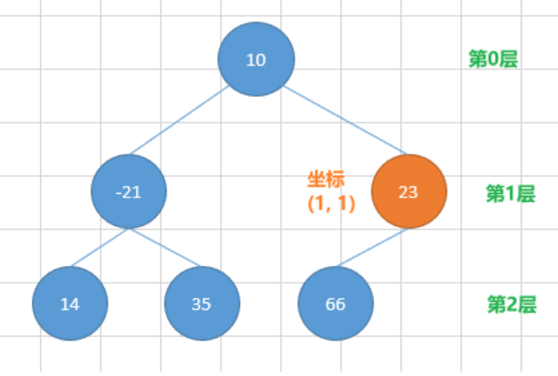

# 253 查找树中的元素or 查找二叉树节点

## 题目描述

已知树形结构的所有节点信息，现要求根据输入坐标（x, y）找到该节点保存的内容值；其中：
- x表示节点所在的层数，根节点位于第0层，根节点的子节点位于第1层，依次类推；
- y表示节点在该层内的相对偏移，从左至右，第一个节点偏移0，第二个节点偏移1，依次类推；



举例：上图中，假定圆圈内的数字表示节点保存的内容值。则上根据坐标(1,1) 查询输出{23}。


## 输入描述

每个节点以一维数组（`int[]`）表示，所有节点信息构成二维数组（`int[][]`），二维数组的0位置存放根节点；

表示单节点的一维数组中，0位置保存**内容值**，后续位置保存子节点在二维数组中的**索引位置**；

对于上图中：
- 根节点可以表示为{10,1,2}
- 树的整体表示为{{10,1,2},{-21,3,4},{23,5},{14},{35},{66}} 

使用标准IO键盘输入进行录入时，先录入节点数量，然后逐行录入节点，最后录入查询的位置，对于上述示例为：
```
6
10 1 2
-21 3 4
23 5
14
35
66
1 1
```
## 输出描述

查询到内容值时，输出{内容值}，查询不到时输出{}

根据坐标(1,1) 查询输出{23}

**补充说明：**

考试者不需要自己编写解析输入文本的代码，请直接使用上述代码中的Parser类解析输入文本；

----

数组s满足：

1<=length(s)<=1000

## 示例描述

### 示例一

**输入：**
```text
6
10 1 2
-21 3 4
23 5
14
35
66
1 1
```

**输出：**
```text
{23}
```

### 示例二

**输入：**
```text
14
0 1 2 3 4
-11 5 6 7 8
113 9 10 11
24 12
35
66 13
77
88
99
101
102
103
25
104
2 5
```

**输出：**
```text
{102}
```

## 解题思路

**基本思路：**

x表示节点所在的层数, y表示偏移量

从nodes中第一个元素node入手：node[0]为根节点，此时深度为0
- 若x为0，直接返回根节点
- 否则，遍历根节点的子节点，深度++
- 若x和深度相同，存储满足条件的当前节点

所存储的节点都是满足层数要求的，节点存储的位置刚好表示偏移量（因为我们是从根节点依次索引得到的）。此时判定是否满足y的要求

**代码思路：**
1. `get_nodes_by_depth`获取满足层数x要求的所有节点
    - 参数nodes为所原始的所有节点；
    - 从根节点依次根据索引index遍历单个节点；
    - depth表示x深度，每往下遍历一层，depth--
    - res存储满足层数要求的所有节点
    > 截止条件：depth == 0（即遍历的层数和x相同）或已经遍历到根节点
2. `get_nodes_by_depth`返回的数组中，索引y的元素即为所求值（注意可能y超范围）

## 解题代码
```python
def solve_method(nodes, x, y):
    # 得到满足层数要求的所有节点，节点的索引即为其偏移
    res = []
    get_nodes_by_depth(nodes, 0, x, res)
    # 得到满足偏移的节点
    if y > len(res):
        return "{}"
    return "{" + str(res[y]) + "}"

def get_nodes_by_depth(nodes, index, depth, res):
    node = nodes[index] # 索引index处的节点，node的取值为{节点值，子节点索引1,...}
    if depth == 0:
        res.append(node[0])
        return res
    # 到达根节点，没有再找到目标节点
    if len(node) == 1:
        return res
    for i in node[1:]:
        get_nodes_by_depth(nodes, i, depth-1, res)

if __name__ == "__main__":
    # 6
    # 10 1 2
    # -21 3 4
    # 23 5
    # 14
    # 35
    # 66
    # 1 1
    num = int(input().strip())
    nodes = []
    for _ in range(num):
        nodes.append(list(map(int, input().strip().split())))
    x, y = map(int, input().strip().split())
    print(solve_method(nodes, x, y))

    assert solve_method([[10,1,2],[-21,3,4],[23,5], [14], [35], [66]], 1, 1) == "{23}"
    assert solve_method([[0, 1, 2, 3, 4], [-11, 5, 6, 7, 8], [113, 9, 10, 11], [24, 12], [35], [66, 13], [77], [88], [99], [101], [102], [103], [25], [104]]
, 2, 5) == "{102}"
```