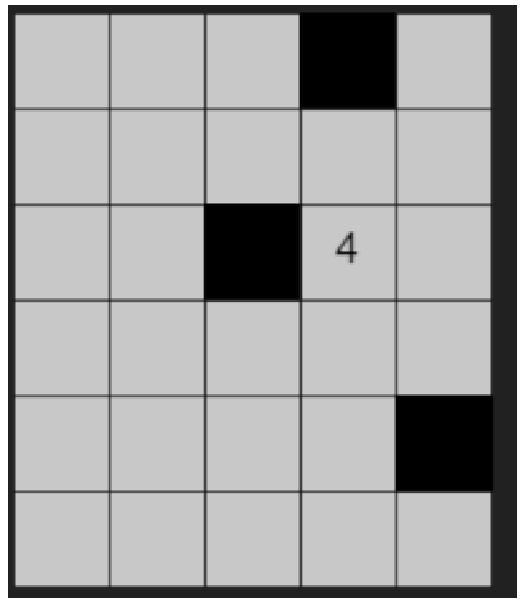
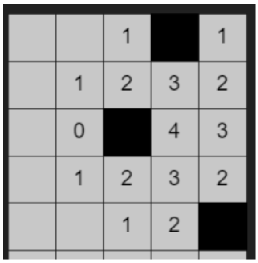

# 263 计算网络信号

## 题目描述

网络信号经过传递会逐层衰减，且遇到阻隔物无法直接穿透，在此情况下需要计算某个位置的网络信号值。

> 注意：网络信号可以绕过阻隔物

- `array[m][n]`的二维数组代表网格地图。
- `array[i][j]=0`代表i行j列是空旷位置。
- `array[i][j]=x`（x为正整数）代表`i`行`j`列是信号源，信号强度是`x`。
- `array[i][j]=-1`代表`i`行`j`列是阻隔物。
- 信号源只有1个，阻隔物可能有0个或多个。
- 网络信号衰减是上下左右相邻的网格衰减1。
- 现要求输出对应位置的网络信号值。

## 输入描述

输入为三行，第一行是`m`和`n`，代表输入是一个`m*n`的数组。

第二行是一串`m*n`个用空格分隔的整数。每连续`n`个数代表一行，再往后`n`个代表下一行，以此类推。对应的值代表对应的网格是空的位置，还是信号源，还是阻隔物。

第三行是`i`和`j`，代表需要计算`array[i][j]`的网络信号值。

注意：此处`i`和`j`均从0开始，即第一行`i`为0。

例如
```
6 5
0 0 0 -1 0 0 0 0 0 0 0 0 -1 4 0 0 0 0 0 0 0 0 0 0 -1 0 0 0 0 0
1 4
```

代表如下地图


需要输出第1行第4列的网络信号值，如下图，值为2


## 输出描述

输出对应位置的网络信号值，如果网络信号未覆盖到，也输出0。一个网格如果可以途径不同的传播衰减路径传达，取较大的值作为其信号值。

### 备注

- `m`不一定等于`n`，m < 100，n < 100，网络信号之小于1000。
- 信号源只有1个，阻隔物可能有0个或多个。
- 输入的`m`、`n`与第二行的数组是合法的，无需处理数量对不上的异常情况。
- 要求输出信号值的位置，不会是阻隔物。

## 示例描述

### 示例一

**输入：**
```text
6 5
0 0 0 -1 0 0 0 0 0 0 0 0 -1 4 0 0 0 0 0 0 0 0 0 0 -1 0 0 0 0 0
1 4
```

**输出：**
```text
2
```

### 示例二

**输入：**
```text
6 5
0 0 0 -1 0 0 0 0 0 0 0 0 -1 4 0 0 0 0 0 0 0 0 0 0 -1 0 0 0 0 0
2 1
```

**输出：**
```text
0
```

## 解题思路

**基本思路：** 使用深度优先搜索DFS求解。

1. 得到信号源`source`。
2. 构造`Block`存储网格的信息，包括坐标`i`、`j`、信号值`value`。
3. 从信号源开始深度优先搜索，遍历所有信号：
  - 遍历信号源上下左右四个相邻位置，并更新信号值。
  - 若相邻位置仍可扩散，则继续递归遍历。
4. 返回对应坐标的信号值。

## 解题代码
```python
class Block:
    def __init__(self, i, j, value):
        self.i = i
        self.j = j
        self.value = value


def solve_method(nums, dest):
    source = [0, 0]
    for i in range(len(nums)):
        for j in range(len(nums[0])):
            if nums[i][j] > 0:
                source = [i, j]

    blocks = [Block(source[0], source[1], nums[source[0]][source[1]])]
    visited = [[0] * len(nums[0]) for _ in range(len(nums))]
    while len(blocks) > 0:
        block = blocks.pop(0)
        diffuse(nums, blocks, visited, block.i, block.j, block.value)
    return nums[dest[0]][dest[1]]


def diffuse(nums, blocks, visited, i, j, value):
    for x, y in [[1, 0], [-1, 0], [0, 1], [0, -1]]:
        if 0 <= i + x < len(nums) and 0 <= j + y < len(nums[0]) and visited[i + x][j + y] == 0:
            visited[i + x][j + y] = 1
            if nums[i + x][j + y] == 0:
                nums[i + x][j + y] = value - 1
            if nums[i + x][j + y] > 1:
                blocks.append(Block(i + x, j + y, nums[i + x][j + y]))


if __name__ == "__main__":
    # 6 5
    # 0 0 0 -1 0 0 0 0 0 0 0 0 -1 4 0 0 0 0 0 0 0 0 0 0 -1 0 0 0 0 0
    # 1 4
    # m, n = map(int, input().strip().split())
    # array = list(map(int, input().strip().split()))
    # nums = [array[i:i + n] for i in range(0, len(array), n)]

    # 目的单元格
    # dest = list(map(int, input().strip().split()))
    # print(solve_method(nums, dest))

    grid = [[0, 0, 0, -1, 0],
            [0, 0, 0, 0, 0],
            [0, 0, -1, 4, 0],
            [0, 0, 0, 0, 0],
            [0, 0, 0, 0, -1],
            [0, 0, 0, 0, 0]]

    assert solve_method(grid, [1, 4]) == 2

    grid = [[0, 0, 0, -1, 0],
            [0, 0, 0, 0, 0],
            [0, 0, -1, 4, 0],
            [0, 0, 0, 0, 0],
            [0, 0, 0, 0, -1],
            [0, 0, 0, 0, 0]]
    assert solve_method(grid, [2, 1]) == 0
```